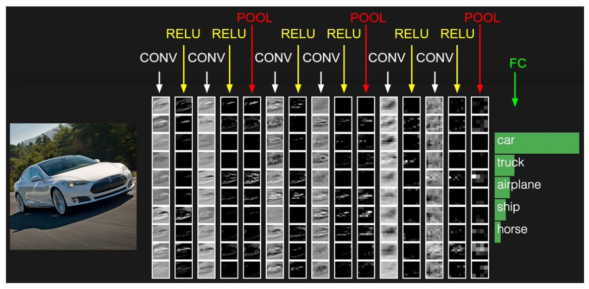
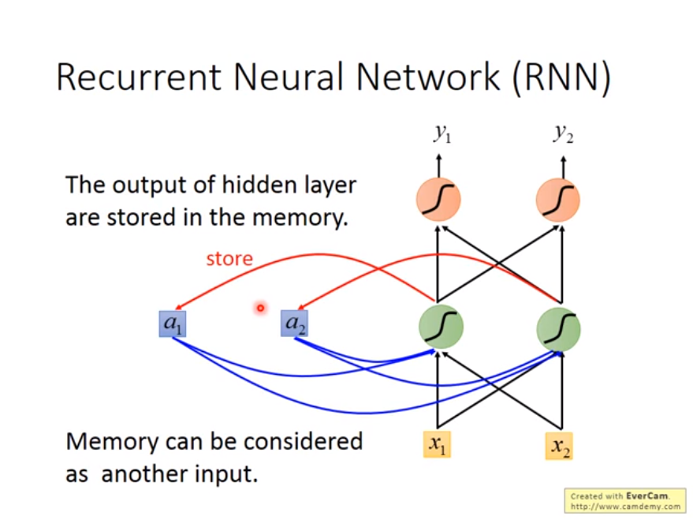
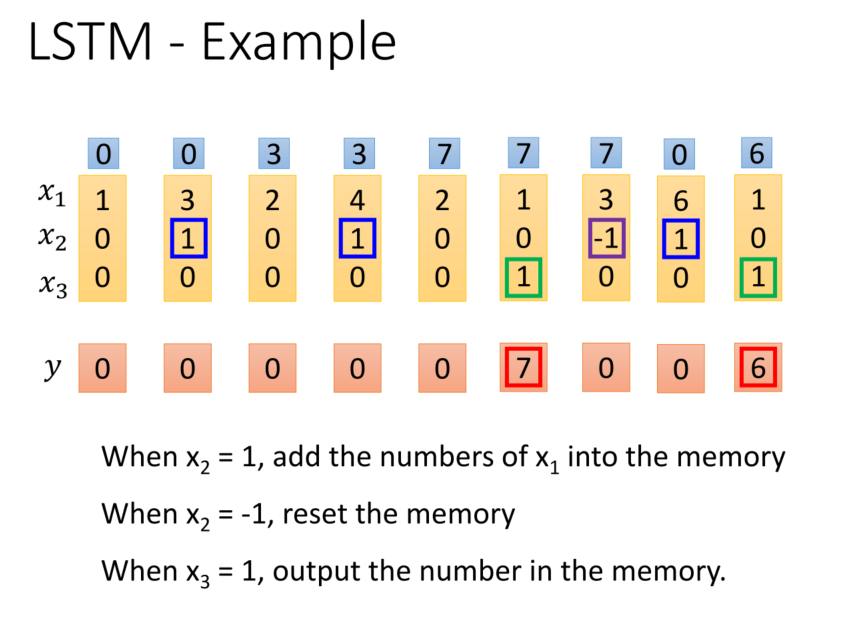
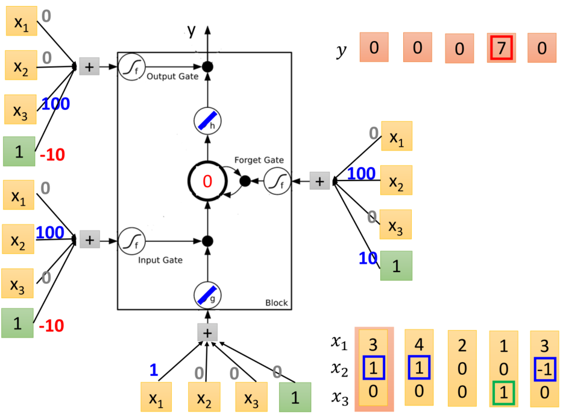

## CNN && RNN
### 講義
* [史丹佛大學 CNN簡報](https://github.com/jumbokh/intro-computers/blob/master/refers/cs231n_2017_lecture5.pdf)
* [史丹佛大學 RNN簡報](https://github.com/jumbokh/intro-computers/blob/master/refers/cs231n_2017_lecture10.pdf)
* [CNN-李弘毅](refers/CNN-李弘毅.pdf)
* [RNN-李弘毅](https://github.com/jumbokh/intro-computers/blob/master/refers/RNN%20(v2).pdf)
* 
##
* [Deep Learning in Computer vision](https://drive.google.com/open?id=1DdxOvxezFkEGnl9QvimslePZO5AaR4eE)
* [視覺辨識課程](https://github.com/jumbokh/cv_face/blob/master/%E8%A6%96%E8%A6%BA%E8%BE%A8%E8%AD%98%E8%AA%B2%E7%A8%8B.pptx)

### 範例
* [標準神經網路做手寫辨識（MNIST）](https://colab.research.google.com/drive/1zzAbObZHF4EJblF3bKwQwfBikrARWOni?authuser=1)
* [CNN--MNIST](https://nbviewer.jupyter.org/github/yenlung/Deep-Learning-MOOC/blob/master/02-1.%20CNN.ipynb)
* [用RNN做情意分析](https://nbviewer.jupyter.org/github/yenlung/Deep-Learning-MOOC/blob/master/04-1.%20RNN.ipynb)
##
* [Deep Learning MOOC](https://github.com/yenlung/Deep-Learning-MOOC)
* [Keras 範例集](https://github.com/keras-team/keras/tree/master/examples)
### 實作
#### CNN 範例

* 
* 
##
#### RNN 範例
* 

<pre>
舉例來說，權重皆為1，沒有偏差單元(bias)，activation function為線性，memory初始為0，輸入為Sequence(1,1,1,1,2,2)。

第一次輸入
(1, 1)
memory(0, 0)
output(4, 4)
update memory(2, 2)
第二次輸入
(1, 1)
memory(2, )
output(12, 12)
update memory(6, 6)
第三次輸入
(2, 2)
memory(6, 6)
output(32, 32)
update memory(16, 16)
輸入的序列有其順序性，從上面簡單的範例可以發現到，調換了順序會造成產生的結果不同。
</pre>
### LSTM 範例
* 
#### 符號約定：
<pre>
1.	Input: zz
2.	操作Input Gate: zizi
3.	操作Forget Gate: zfzf
4.	操作Output Gate: zozo
5.	Output: aa
6.	Memory Cell: CC
</pre>
#### 流程說明：
<pre>
1.	ZZ通過sigmoid function得到g(z)g(z)
2.	ZiZi通過sigmoid function得到g(zi)g(zi)
3.	1、2所得相乘得到g(z)f(zi)g(z)f(zi)
4.	ZfZf通過sigmoid function得到g(zf)g(zf)
5.	Memory Cell乘上Forget Gat的值，得到cf(zf)cf(zf)
	當forget gate的輸入為0，那代表之前存在memory cell的值會變0
	當forget gate的輸入為1，那代表之前存在memory cell的值會保留
6.	將5、3相加得到c′c′
	c′=g(z)f(zi)+cf(zf)c′=g(z)f(zi)+cf(zf)
	當input gate的輸入為0，那就相當於沒有更新
	當input gate的輸入為1，那就相當於直接把g(z)g(z)當做輸入
7.	Memory Cell cc變為c′c′
8.	c′c′通過h function得到h(c′)h(c′)
9.	zozo通過sigmoid function得到f(zo)f(zo)
	當output gate的輸入為1，代表可以通過
	當output gate的輸入為0，則f(zo)f(zo)為0，代表無法通過
10.	9、10相乘得到a=h(c′)f(zo)a=h(c′)f(zo)
</pre>
#### activation function:
<pre>
o	通常選擇使用Sigmoid Function，因為輸出是介於0、1之間的值，用以代表gate被打開的程度
</pre>
#### 見: [LSTM-李弘毅](refers/LSTM-李弘毅.pdf)
* 
##
* [調校你的 CNN](https://colab.research.google.com/drive/1VNMBiBvsIWfyy5ug37LN8ycN26VSPUjI?authuser=1)
* [改造你的 1 號神經網路](https://colab.research.google.com/drive/1-h0WCVzl_ImkrThzQzCKYRURVBeJXMoG?authuser=1)
### 參考
* [CNN中的参数解释及计算](https://flat2010.github.io/2018/06/15/%E6%89%8B%E7%AE%97CNN%E4%B8%AD%E7%9A%84%E5%8F%82%E6%95%B0/)
* [初探卷積神經網路](https://chtseng.wordpress.com/2017/09/12/%E5%88%9D%E6%8E%A2%E5%8D%B7%E7%A9%8D%E7%A5%9E%E7%B6%93%E7%B6%B2%E8%B7%AF/)
* [ML Lecture 25: Recurrent Neural Network](http://violin-tao.blogspot.com/2017/12/ml-recurrent-neural-network-rnn-part-i.html)
* [李弘毅課程](http://speech.ee.ntu.edu.tw/~tlkagk/courses_ML17_2.html)
* [李宏毅机器学习课程笔记](https://github.com/datawhalechina/leeml-notes)
* [李宏毅机器学习课程笔记9：Recurrent Neural Network](https://blog.csdn.net/xzy_thu/article/details/74930482)
* [李宏毅_ML_Lecture_21-1](https://hackmd.io/@shaoeChen/BJ14sUSzN?type=view)
* [CS231n Convolutional Neural Networks for Visual Recognition](http://cs231n.github.io/convolutional-networks/)
* [史丹佛大學 CS2371n 講義](http://cs231n.stanford.edu/slides/2017/)
* [Youtube: Stanford University CS231n, Spring 2017](https://www.youtube.com/watch?v=bNb2fEVKeEo&list=PLC1qU-LWwrF64f4QKQT-Vg5Wr4qEE1Zxk&index=5)
### Youtube
* [Stanford University CS231n, Spring 2017](https://www.youtube.com/playlist?list=PLC1qU-LWwrF64f4QKQT-Vg5Wr4qEE1Zxk)
    * [Lecture 5 | Convolutional Neural Networks](https://www.youtube.com/watch?v=bNb2fEVKeEo&list=PLC1qU-LWwrF64f4QKQT-Vg5Wr4qEE1Zxk&index=6&t=0s)
    * [Lecture 10 | Recurrent Neural Networks](https://www.youtube.com/watch?v=6niqTuYFZLQ&list=PLC1qU-LWwrF64f4QKQT-Vg5Wr4qEE1Zxk&index=11&t=0s)
* [Recurrent Neural Networks (RNN) and Long Short-Term Memory (LSTM)](https://www.youtube.com/watch?v=WCUNPb-5EYI)
* [李宏毅](https://www.youtube.com/channel/UC2ggjtuuWvxrHHHiaDH1dlQ/playlists)
    * [ML Lecture 21-1: Recurrent Neural Network (Part I)](https://www.youtube.com/watch?v=xCGidAeyS4M&list=PLJV_el3uVTsPy9oCRY30oBPNLCo89yu49&index=30)
    * [ML Lecture 21-2: Recurrent Neural Network (Part II)](https://www.youtube.com/watch?v=rTqmWlnwz_0&list=PLJV_el3uVTsPy9oCRY30oBPNLCo89yu49&index=31)
