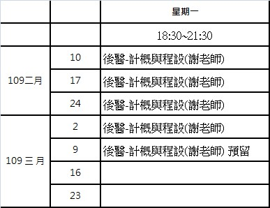
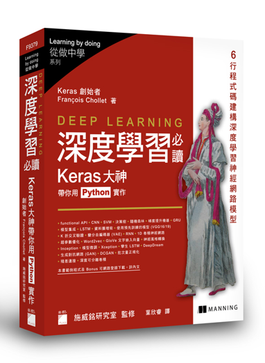

# intro-computers
### 後醫-計概課程
* 
* [課程大綱](https://github.com/jumbokh/intro-computers/blob/master/refers/%E5%BE%8C%E9%86%AB-%E8%A8%88%E6%A6%82%E8%AA%B2%E7%A8%8B%E5%AE%89%E6%8E%92%E5%A4%A7%E7%B6%B1.pdf)
##
### 機器學習
#### 講義 & PPT
* [講義](https://github.com/jumbokh/intro-computers/blob/master/%E8%AC%9B%E7%BE%A9.pdf)
* [PPT]()
#### 程式
* [簡單迴歸](https://nbviewer.jupyter.org/github/jumbokh/intro-computers/blob/master/src/simple_regression.ipynb)
* [正則化](https://nbviewer.jupyter.org/github/jumbokh/intro-computers/blob/master/src/%E6%AD%A3%E5%89%87%E5%8C%96.ipynb)
* [標準化](https://nbviewer.jupyter.org/github/jumbokh/intro-computers/blob/master/src/standardizing_sequence.ipynb)
* [Normalization](https://nbviewer.jupyter.org/github/jumbokh/intro-computers/blob/master/src/Normalizing_Sequence.ipynb)
* [05.06 Linear Regression](https://nbviewer.jupyter.org/github/jumbokh/regression_learn/blob/master/src/05.06-Linear-Regression.ipynb)
#### 參考連結
* [动手学深度学习](https://1024.com/a/279/%E4%B8%80%E6%9C%AC%E6%B7%B1%E5%BA%A6%E5%AD%A6%E4%B9%A0%E7%9A%84%E5%A5%BD%E4%B9%A6dive-into-deep-learning-%E4%B8%AD%E8%8B%B1%E6%96%87)
* [機器學習算法導論](https://lib-nuanxin.wqxuetang.com/#/Book/3208845)
* [SGD, Momentum, AdaGrad, Adam Optimizer](https://mc.ai/%E6%A9%9F%E5%99%A8%E5%AD%B8%E7%BF%92ml-notesgd-momentum-adagrad-adam-optimizer-2/)
* [机器学习之路：python线性回归分类器 LogisticRegression SGDClassifier 进行良恶性肿瘤分类预测](https://www.cnblogs.com/Lin-Yi/p/8970510.html)
* [vs.code Download](https://code.visualstudio.com/)
* [Deeplearning Algorithms Tutorial ](https://github.com/KeKe-Li/tutorial)

#### 參考書目
* 
* [旗標-深度學習必讀](https://www.flag.com.tw/books/product/F9379)
* 
* [鴻海-人工智慧導論](https://www.books.com.tw/products/0010826415)
* 
* [歐萊里-Python 數據科學手冊](https://www.books.com.tw/products/CN11517291)
